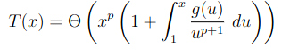
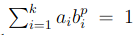
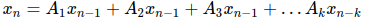
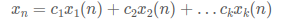
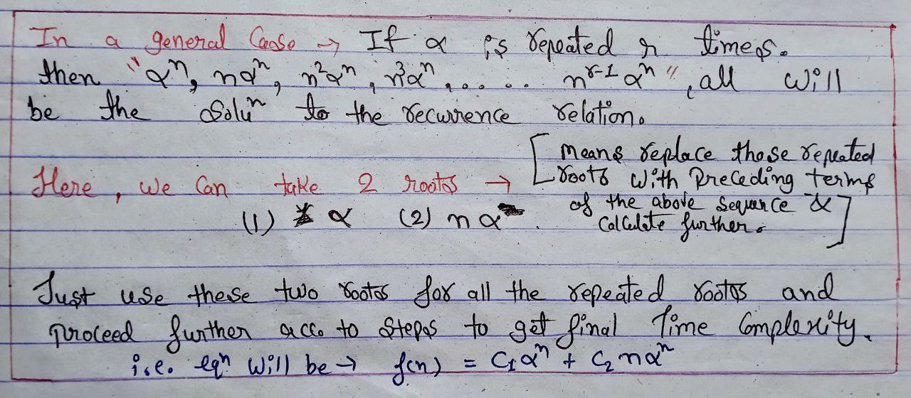

## Recursive Algorithm's Complexities.

* Analysed Recursive fibonacci program's space complexity.

* Points to remember during recursive algo. analysis.
                
        * No Function calls that are at the same level in recursion tree can be in the STACK at the same TIME.

        * Only the func. calls that are inter-linked can be in the STACK at the same TIME.

* Above points concludes that recursive fibonacci has a SPACE COMPLEXITY of O(n) | n = height of the recursive tree.

## Types of Recursion (Recurrence Relations)

**1. Linear Recurrence Relation. :** Relation in which recursion is solved in smaller chunks. i.e. Fibonacci sequence using recursion.

**2. Divide & Conquer Recurrence Relation. :** Relation in which Problem is divided into multiple halfs i.e. Binary search using recursion.

## Divide & Conquer methods:
 There are many different methods to solve it.

1. **Plug & Chug**
2. **Master's Theorem**
3. **Akra Bazzi :** It was developed in 1996, we'll learn this to solve any **divide & conquer recurrence relation**.

**Form of divide and conquer recursions:** T(n) = a1 * T(b1n + f1(n)) + ... + g(x).
   
## Akra-bazzi Method :
The general form of the Akra-Bazzi formula is as follows:

**we have:** T(n) = ∑[k=1 to r] a(k) * T(b(k) * n + h(k)) (recurrence relation)

**Here:**

* T(n) represents the time complexity of the algorithm for an input size of n.
  
* a(k), b(k), and h(k) are coefficients associated with each term in the sum.
* r is the number of terms in the sum.
   
---
  
**Formula :** 

### Here:

* we have to find ***p*** by the formulae : 
  
  

* There are many intuitions to find ***p*** that i'm unable to share here.
* ***g(u)*** is the last function at the recurrence form (After all the Recursion expressions).

### Benefits

1. Easier with many of the recurrence relations.
2. It can solve much complex recurrences with complex coefficients.
3. Easier over ***master's theorem & drawing tree***.
---

### **Method to Solve Linear Recurrences :**

**Form of Linear recursions:** 

(eq. (1) put your equation here)

---

**Step 1 :**

* put f(x)= βx (betax), f(x-1)=βx-1 and so on.
* The simplified eq. is called ***Characteristic eq. of recurrence***.
* Solve the simplified equation and get all the roots.

**Step 2 :**

* Build a equation by substituting this roots as '*x1, x2 ... xn*' in : 

 **where all *n* lie in the power**.

* Consider it as eq. (2)
  
**Step 3 :** 

* **Fact :** No. of roots == no. of solutions we have.
* *For Example:* **f(0)=0** is a slution we have, solve this using eq.(2), do the same for all the roots.

* You may have found the constants now i.e. C1, C2 ... etc.

* Now put this constants into eq.(2).

* The resulted formula can be used to solve the corresponding recurrence relations.

* Further Simplify this by the rules of Complexity, to get the actual **Time Complexity**.

---

### **Exception :** Duplicate Roots 
 

If we got multiple duplicate roots  from the **Characteristics Equation** from **Step 1**, then use missing roots from the form below : 

 

