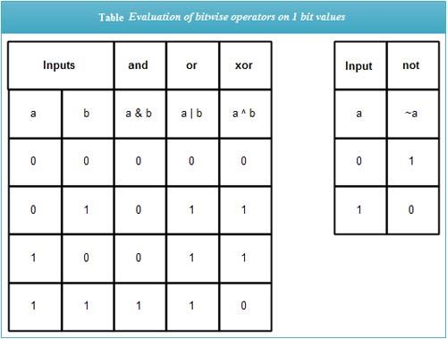

# *Number System*
 * A Mathematical Notation or System used to represent numbers.
 * It Provides ways to express & manipulate numerical values in a consistent manner.
 * Each distinct Number System uses different number of symbols i.e. **Base of the System**.

#### The main Number Systems used are described below :

**1. Decimal System :**
* It uses 10 symbols, and is the Number System we use in our daily lives.
* The Symbols used are : **0, 1, 2, 3, ...,9**.
* It is called **Base(10)**.

**2. Binary System :**
* It uses 2 symbols, they are : **0 & 1 (bits)**.
* It is called **Base(2)**.

**3. Octal System :**
* It uses 8 symbols, they are : **0, 1, 2, 3, ...,7**.
* It is called **Base(8)**.
  
**4. Hexadecimal System :**
* It uses **16 symbols**.
* The Symbols used are : **0, 1, 2, ...,9 & A, B, C, ... , F.**
* It is called **Base(16)**.
---
### *Conversion From & Into these different Number Systems.*

**(A) Decimal to Base(x) System :**
* Keep dividing the **decimal** number by the **'x'** of given base(x).
* Write down all the remainders from these divisions. **|** Remainders should be in base(x) system.
* Arrange these remainders into reversed order to get the **answer**.

**(B) Base(x) to Decimal System :**
* Select each digit of Base(x) from the Right Side.
* Multiply these digits with each term of the sequence :
    
    **x0, x1, x2,  ..., xn-1.**  
    where **x = Base of given Number System** & **n = Number of digits**

* Add up these digits to get the **answer**.

**(C) Base(x) to Base(y) System :**

  * First Convert **Base (x) to Decimal System** by above process.
  * Then Convert resulted **Decimal to Base(y) System** by above process. | You'll have your **answer**.

---
 

# Bitwise Operators:

* Operators that work on Binary Bits **(0 & 1)**.
* used to perform **bit Manipulation**.

#### Examples : 

* (Let 0=False & 1=True).

**1. AND Operator (&) :** It results in True (1) if all the input bits are True (1).

**2. OR Operator (|) :** It results in True (1) if atleast one single input bit is True (1)

**3. XOR Operator (^) :** It results in True (1) if only one of the input bits is True (1).
* Also Called **Exclusive Or & If and only if** Operator.

**4. NOT Operator (~) :** It results in the opposite bit of the single input bit.
* It only works on a single bit.

 
 

#### *Below Operators work directly only with Binary Numbers.*
**5. Left Shift Operator (<<) :** It Left shifts the binary bits by a specified Number of position (by adding 0). 

i.e. 1010 << 2 == 1010**00**.

* **General Formula:
   |a<<b = a * 2b |**

**5. Right Shift Operator (>>) :** It Right shifts the binary bits by a specified number of position **(by only removing digits from right side)**.

i.e. 1010 >> 2 == 10.

* **General Formula:
   | a<<b = a / 2b |**