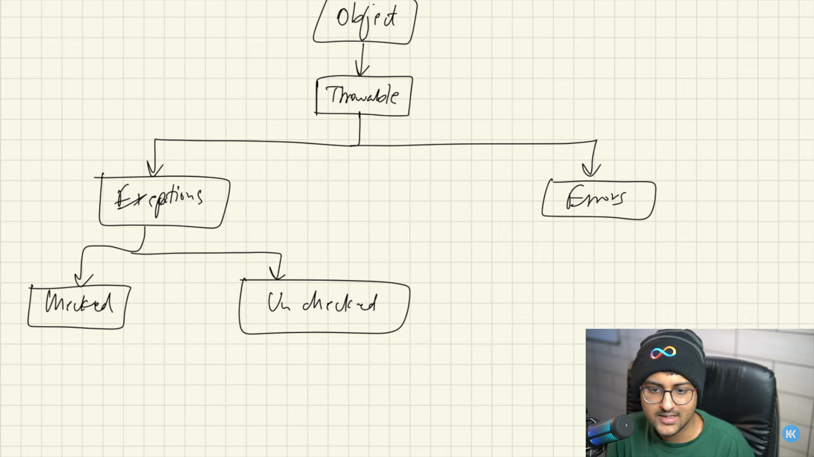

### **Now that we know OOP Core Concepts, let's create Our Custom ArrayList:**

## Custom ArrayList : 
Custom ArrayList replicating the functionality of built-in ArrayList Type. By Implementing various methods and techniques.

The List we created in "CustomListExample.java" file, it's not worth it.

Cause it can work only with "int" data types 
Even if we adapt it to multiple data types, we we'll have to change almost 90% of our code!!

This problem will be solved using Generics.

## Generics :

Generics allow you to abstract over types.

In java, Generics provide a way to create classes, interfaces & methods with place-holders for data types. 
The main purpose of this is to enable you to write code that can work with different type of data while maintaining type safety.

When using generics in Java, you can use any valid identifier as a placeholder for the generic type, and it's common to see single uppercase letters like T, K, V, E, or any other meaningful identifier that follows Java's naming conventions.

Docs [1](https://docs.oracle.com/javase/tutorial/extra/generics/intro.html), [2](https://docs.oracle.com/javase/tutorial/java/generics/types.html).

[Restrictions](https://www.google.com/url?sa=t&rct=j&q=&esrc=s&source=web&cd=&cad=rja&uact=8&ved=2ahUKEwjsx-m80YmDAxW6fGwGHfAYAzMQFnoECA4QAQ&url=https%3A%2F%2Fdocs.oracle.com%2Fjavase%2Ftutorial%2Fjava%2Fgenerics%2Frestrictions.html&usg=AOvVaw3L3i-PE7RnXld1CIQlfI2I&opi=89978449) Over Generic Usage!

Example code of Generics are [here](./CustomGenList.java).

## Wildcards in Generics :

It's a way to give more flexibility while programming.

It is used where a type parameter is given like `List<Type>`

It allows more flexible type parameter than a specific class or interface. It is useful when we want to operate on different types without committing to a specific type. 

It is denoted using **"?"**.

There are three **types** of Wildcards :

1. Unbounded wildcard. `List<?> myList;`
2. Upper bounded wildcard. `List<? extends Number> numberList;`
3. Lower bounded wildcard. `List<? super Integer> integerList;`

These are described more in the example file : [WildCards.java](./WildCards.java).

Read more [here](https://docs.oracle.com/javase/tutorial/extra/generics/wildcards.html).

## Comparing Objects.

1. We must implement `Comparable<type>` interface to add "comparing" Functionality
2. We must override `compareTo()` method to compare different objects of same types.
3. This method is used implicitly to sort Arrays of Objects.

4. `Arrays.sort` method also takes an array with a `Comparable` obj. To define, how they'll be compared.

**[`Comparable` Example](./CompareObj.java)**.

## Lambda Expressions.

Lambda expressions provide a concise way to express instances of single-method interfaces (functional interfaces).

When we use `ArrayList.foreach(lambda expression)`, it actually takes a `Consumable` interface object, that we define it's method via lambda expressions.

**We thought, interfaces can't be Instantiated??**

In Java, you can use lambda expressions to create objects of functional interfaces. **Functional interfaces are interfaces that have only one abstract method**, and they can be instantiated using lambda expressions. Lambda expressions provide a concise way to express instances of single-method interfaces **without the need to create an anonymous class.**

**[Example of Lambda Expressions](./Lambda.java.)**.

## Exceptions & Errors :

</img>

### Errors :
Errors are more severe problems that typically indicate a fundamental problem with the Java Virtual Machine (JVM) or the system hosting the JVM. Unlike exceptions, errors are generally not meant to be caught or handled by regular application code.

i.e. **StackOverflowError**, **OutOfMemoryError** etc.

### Exceptions : 
Exceptions are abnormal conditions or errors that occur during the execution of a Java program. They are divided into two main categories: checked exceptions and unchecked exceptions.

1. **Checked Exceptions :** These are exceptions that the compiler forces you to handle or declare in the throws clause of a method.

2. **Unchecked Exceptions :** These are exceptions that the compiler does not enforce you to handle explicitly. | They occur at **Runtime**.

3. We can also create our custom Exceptions by extending  `Exception` class.

**[Brief Example.](./ExceptionsExample.java)**

## [Object Cloning :](./Cloning.java)

Object Cloning is making another object with the **"same state"** as the other.

* we must implement `Cloneable` interface to allow a class's object to be cloned.
* And then override the `Object.clone` method.
* This `clone` method can throw an Exception : `CloneNotSupportedException`.

### Shallow Copy :

If we copy an object that **contains one or more objects** in it.
Shallow copy **won't create new Object for inner objects**.
Instead, it will share those inner objects with cloned objects also.

Hence, if we modify **inner Objects** from Original Object.
it will also be modified to **Cloned Objects**

`It will copy only primitives not Inner Objects.`

### Deep copy :

Deep copy Creates **new objects** for **Inner objects** also while cloning an object.
This way we can have Entirely isolated Cloned objects of existing objects.

`It will Copy existing data including Primitives & Objects to the newly cloned object.`