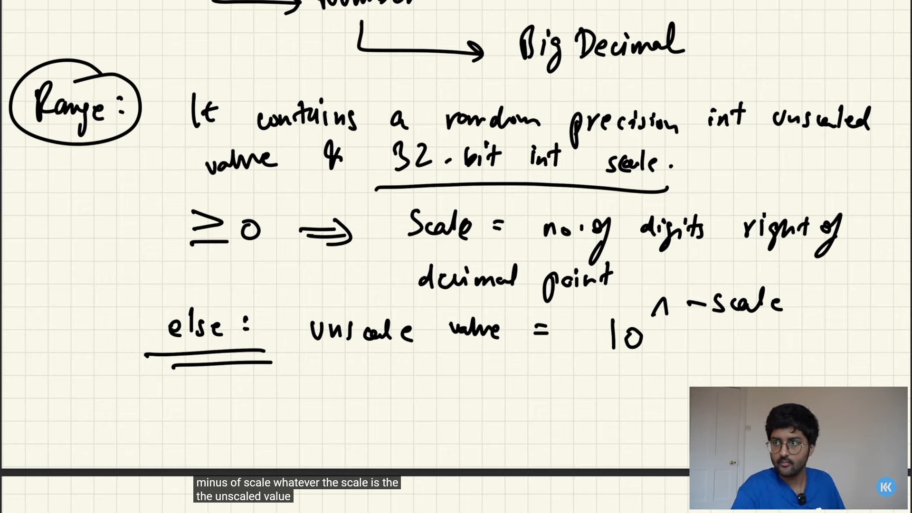

# Handling large numbers!!

When it comes to handling really large numbers whether they are Integers or Decimals! It may happen that basic types like int, float & even long and double are not able to store that large Numbers!

In that situation Java's `BigInteger` & `BigDecimal` classes comes handy!

You can learn more about their class hierarchy [here](https://docs.oracle.com/cd/E13222_01/wls/docs45/classdocs/java.math.BigInteger.html)!

## Big Integer

What are the Range of these ***Big Number*** classes?!

BigInteger $\rarr \ -2^{63} \ to \ 2^{63}-1$

Working with BigInteger - [See Here](./BigNumbers.java).

Also see Factorial program for Big Integers with `BigInteger` [Here](./FactorialBigInteger.java).

## Big Decimal

First let's talk about what's `precision error` 

In both Java and Python, the result of `0.03 - 0.02` may not be exactly 0.01 due to the way floating-point numbers are represented in computers.

This is because floating-point numbers are represented as binary fractions, which can lead to rounding errors. In this case, the result of the subtraction may be something like `0.009999999999999998` instead of exactly `0.01`.

This is a common issue in programming languages that use floating-point arithmetic, and it's known as "floating-point precision error".

#### Hence, **BigDecimal** class is used to overcome precision errors!

It's something about how `BigDecimal` scales floating point numbers!

Working with `BigDecimal` [Here](./BigDecimalNumbers.java).

[Read more](https://docs.oracle.com/javase%2F7%2Fdocs%2Fapi%2F/java/math/BigDecimal.html).

> python have `decimal` module to overcome this precision error.