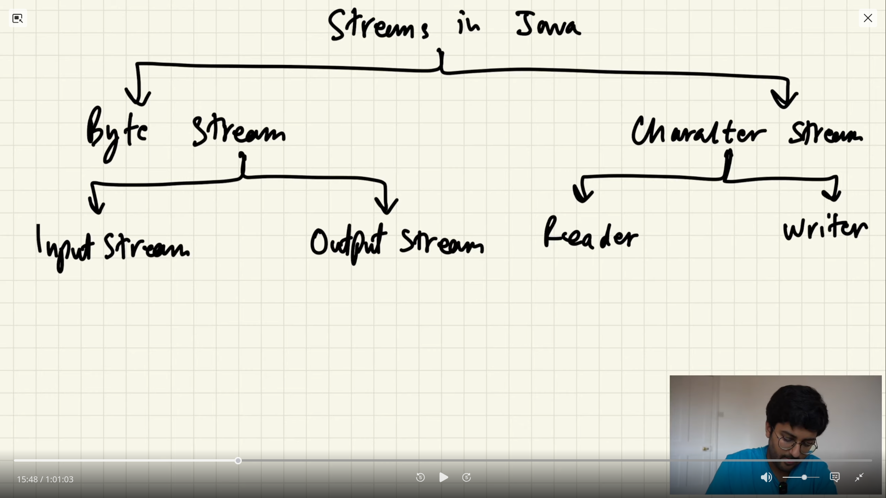

# File Handling In Java

Working with files (file like objects) is necessary when reading or writing input/output to files and save data to disk storage in our programs.

### 1. Streams

In Java, streams refer to input/output streams, which are used for reading and writing data to various sources, such as files, networks, and consoles. Two main types of I/O Streams are :

  

- **Byte Streams :** Works with reading and writing bytes (binary) data for various sources like files, consoles!

    - Further classes : *FileInputStream, FileOutputStream, ByteArrayInputStream & ByteArrayOutputStream etc.*

- **Character Streams :** Helps reading & writing characters from source or to destination.

    - child classes : *FileReader, FileWriter, StringReader and StringWriter etc.*
  
There are many classes that are specific to their use cases to work with I/O data streams. We can distinguish as: `_reader, _writer` classes for **character stream** & `_stream` classes for **bytes data**.

**IOException :** Exceptions with input/output operations i.e. corrupt file, unable to read etc.

**Predefined Streams:**  
  - System.in -> standard input -> Keyboard
  - System.out -> standard output -> Console etc.

---

### Working with Character Reader classes : [Here.](./CharReaders.java)

