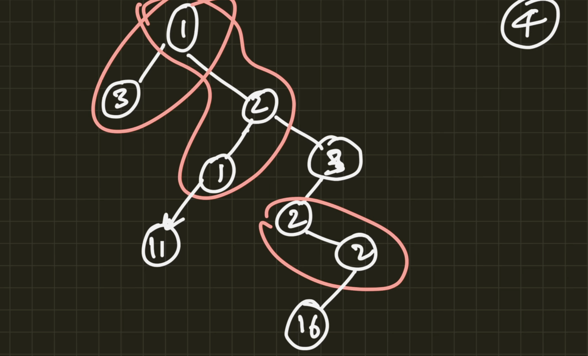

# **Binary Trees Questions**

Questions on Trees are solved, all that are executed in the lecture!
Mostly questions are on **LeetCode**.


## Breadth First Search (Order level search)

This algo asks us to visit the nodes of a tree level by level.

First visit root node, then all nodes on next level, then continue next level...

#### When to use BFS?

- When answer probably lies near the root node.
- When operations should be performed level wise in the tree.


#### Implementation

Starting visit from the **root node**, we will store every child in an **queue**, then continuing until the queue becomes empty.

## 1. [Level order search](https://leetcode.com/problems/binary-tree-level-order-traversal/description/)

The question asks us to return a list of lists where each of the sublists contains the elements of each level of the tree, in the order of their level.

like this:  `[[3],[9,20],[15,7]]`

#### code :

```java
import java.util.LinkedList;
import java.util.Queue;


class Solution {
    public List<List<Integer>> levelOrder(TreeNode root) {
        Queue<TreeNode> queue = new LinkedList<>();
        List<List<Integer>> output = new ArrayList<>();

        if (root != null){
            queue.add(root);
        }

        while (!queue.isEmpty()){
            List<Integer> inner = new ArrayList<>();
            
            int size = queue.size();

            // Adding for current level!
            while (size > 0){
                TreeNode n = queue.remove();
                inner.add(n.val);

                if (n.left != null) {queue.add(n.left);}
                if (n.right != null) {queue.add(n.right);}
                size--;
            }
            
            output.add(inner);
        }
        

        return output;
    }
}
 
```


## 2. [Average of Levels in Binary Tree](https://leetcode.com/problems/average-of-levels-in-binary-tree/description/)

Almost same as previous.


```java
import java.util.LinkedList;
import java.util.Queue;

class Solution {
    public List<Double> averageOfLevels(TreeNode root) {
       Queue<TreeNode> queue = new LinkedList<>();
        List<Double> output = new ArrayList<>();

        if (root != null){
            queue.add(root);
        }

        while (!queue.isEmpty()){
            Double total = 0.0;
            int size = queue.size();

            // Adding for current level!
            for(int i = 0; i<size; i++){
                TreeNode n = queue.remove();
                total += n.val;

                if (n.left != null) {queue.add(n.left);}
                if (n.right != null) {queue.add(n.right);}
            }
            
            output.add(total/size); // One of them should be double!
        }
        

        return output; 
    }
}

```

## 3. Level order successor of a Node

Getting successor of a node in a level wise manner.

```java
import java.util.LinkedList;
import java.util.Queue;

class Solution {
    public TreeNode averageOfLevels(TreeNode root, int val) {
        Queue<TreeNode> queue = new LinkedList<>();
            
        if (root != null){
            queue.add(root);
        }

        while (!queue.isEmpty()){
            TreeNode n = queue.remove();

            if (n.left != null) {queue.add(n.left);}
            if (n.right != null) {queue.add(n.right);}
            
            // Check after adding!
            if (n.val == val){
                return queue.peek(); // doens't throw error if queue is empty!
            }
        }
        

        return null; 
    }
}

```


## 4. [Binary Tree Zigzag Level Order Traversal](https://leetcode.com/problems/binary-tree-zigzag-level-order-traversal/description/)


We just need to change some logic. Using the reverse flag, we traverse specific levels in reverse order! Hence Zigzag Pattern at last.

```java
import java.util.LinkedList;
import java.util.Deque;

class Solution {
    public List<List<Integer>> zigzagLevelOrder(TreeNode root) {
        Deque<TreeNode> queue = new LinkedList<>();
        List<List<Integer>> output = new ArrayList<>();

        if (root != null){
            queue.add(root);
        }
        
        boolean reverse = false;

        while (!queue.isEmpty()){
            List<Integer> inner = new ArrayList<>();
            
            int size = queue.size();

            // Adding for current level!
            while (size > 0){
                if (reverse){
                    // Reverse logic!
                    TreeNode n = queue.pollLast();
                    inner.add(n.val);

                    if (n.right != null){
                        queue.offerFirst(n.right);
                    }

                    if (n.left != null){
                        queue.offerFirst(n.left);
                    }
                }

                else{
                    TreeNode n = queue.remove();
                    inner.add(n.val);

                    if (n.left != null) {
                        queue.add(n.left);
                    }

                    if (n.right != null) {
                        queue.add(n.right);
                    }
                }

                size--;
            }
            
            reverse = !reverse;
            output.add(inner);
        }
        
        return output;
    }
}

```


## 5. [Level Order Traversal II](https://leetcode.com/problems/binary-tree-level-order-traversal-ii/description/)

Here, we just need to traverse the tree levels in reversed form, from leafs to the root.\
So, we will modify existing code a little bit, adding inner lists [per level], at ***0*** index always!

```java
import java.util.LinkedList;
import java.util.Queue;

class Solution {
    public List<List<Integer>> levelOrderBottom(TreeNode root) {
        Queue<TreeNode> queue = new LinkedList<>();
        List<List<Integer>> output = new ArrayList<>();

        if (root != null){
            queue.add(root);
        }

        while (!queue.isEmpty()){
            List<Integer> inner = new ArrayList<>();
            
            int size = queue.size();

            while (size > 0){
                TreeNode n = queue.remove();
                inner.add(n.val);

                if (n.left != null) {queue.add(n.left);}
                if (n.right != null) {queue.add(n.right);}
                size--;
            }
            
            output.add(0, inner); // Inserting at the start!
        }
        

        return output;
    }
}

```

## 6. [Populating Next Right Pointers in Each Node](https://leetcode.com/problems/populating-next-right-pointers-in-each-node/description/)

Reading the description of the question, we can have few approaches to this question!

### A. Solution that works on **any Tree**, no matter it's perfect binary tree or not!

It is a slight modification of the previous **BFS code**.

```java

import java.util.Queue;
import java.util.LinkedList;

class Solution {
    public Node connect(Node root) {
        Queue<Node> queue = new LinkedList<>();

        if (root != null){
            queue.offer(root);
        }

        while (!queue.isEmpty()){
            int size = queue.size();

            // For each level
            for (int i = 0; i<size; i++){
                
                // Assign next pointers
                Node n = queue.poll();

                // Assign next node by peek!
                // If it's not the last in this level!
                if (i != size-1){
                    n.next = queue.peek();
                }
                // Else Assign to null 
                else{
                    n.next = null;
                }
                
                if (n.left != null){
                    queue.offer(n.left);
                }
                
                if (n.right != null){
                    queue.offer(n.right);
                }
            }
        }

        return root;

    }
}

```

### B. Efficient and concise Solution that works especially for perfect binary tree.

This connects all children of current node, going level by level !

```java
// For Perfect BT, Iterative

import java.util.Queue;
import java.util.LinkedList;

class Solution {
    public Node connect(Node rootNode) {
        Queue<Node> queue = new LinkedList<>();

        if (rootNode != null){
            queue.offer(rootNode);
        }


        while (!queue.isEmpty()){
            Node root = queue.poll();

            if (root.right != null){
                root.left.next = root.right; // A Perfect BT.

                // Both exists
                queue.offer(root.left);
                queue.offer(root.right);
            }
            
            if (root.right != null && root.next != null){
                root.right.next = root.next.left;
            }

        }

        return rootNode;

    }
}
```

### C. Above solution with recursion (Concise code).

Because assigning ***next pointer*** doesn't require us to be level by level, we can use *Depth First Search* here with recursion stack.

```java
// For Perfect BT, Recursive, DFS

import java.util.Queue;
import java.util.LinkedList;

class Solution {
    public Node connect(Node root) {
        if (root == null){
            return root;
        }

        if (root.right != null){
            root.left.next = root.right;
        }

        if (root.right != null && root.next != null){
            root.right.next = root.next.left;
        }

        connect(root.left);
        connect(root.right);

        return root;
    }
}
```

## 7. [Binary Tree Right Side View](https://leetcode.com/problems/binary-tree-right-side-view/description/)

This is again just BFS solution, the only difference is that we are adding only the last node's value in each level.

There are also some DFS solutions (maybe more efficient) out there. We're doing the BFS one now.


```java
import java.util.Queue;
import java.util.LinkedList;
import java.util.ArrayList;

class Solution {
    public List<Integer> rightSideView(TreeNode root) {
        ArrayList<Integer> ans = new ArrayList<>();
        Queue<TreeNode> queue = new LinkedList<>();

        if (root != null){
            queue.offer(root);
        }

        while (!queue.isEmpty()){
            int size = queue.size();

            for (int i = 0; i<size; i++){
                TreeNode n = queue.poll();

                // If last node of current level.
                if (i == size-1){
                    ans.add(n.val);
                }

                // Insert it's children!
                if (n.left != null){
                    queue.offer(n.left);
                }

                if (n.right != null){
                    queue.offer(n.right);
                }
            }
        }

        return ans;
    }
}
```

## 8. [Cousins in Binary Tree.](https://leetcode.com/problems/cousins-in-binary-tree/description/)

Given `x` and `y`, two nodes in a tree having unique node values, we have to find they are cousins or not!

Two nodes are cousins if they are at the **same level** and have **different parents**.

### Solution 1: Iterative BFS

```java
import java.util.Queue;
import java.util.LinkedList;
import java.util.ArrayList;
import java.util.Arrays;

class Solution {
    public boolean isCousins(TreeNode root, int x, int y) {
        Queue<List<TreeNode>> queue = new LinkedList<>();
        
        if (root != null) queue.offer(new ArrayList<>(Arrays.asList(root)));

        while (!queue.isEmpty()){
            int levelSize = queue.size();
            
            // Get a score for each level, having node or not!
            int levelScore = 0;
            for (int i = 0; i<levelSize; i++){
                List<TreeNode> siblings = queue.poll();
                
                // For each siblings
                int siblingScore = 0;
                for (int j = 0; j<siblings.size(); j++){
                    TreeNode cur = siblings.get(j);

                    if (cur.val == x || cur.val == y){
                        siblingScore += 1;
                    }
                    
                    // Add children!
                    if (cur.left != null || cur.right != null){
                        List<TreeNode> children = new ArrayList<>();
                        
                        if (cur.left != null) children.add(cur.left);
                        if (cur.right != null) children.add(cur.right);

                        queue.offer(children);
                    }
                }

                // Check if siblings?
                if (siblingScore == 2){
                    return false;
                }

                // Add to level score
                levelScore += siblingScore;
            }

            // Check if cousins or not!
            if (levelScore == 2){
                return true;
            }
            
            // If one node on this level.
            else if (levelScore == 1){
                return false;
            }

            // No node, check next level!
        }

        return false;
    }
}

```

### Solution 2: Concise recursive BFS

Recursively find x and y nodes and storing their details, then checking if they are cousins or not !

```java
// Using DFS
class Solution {
    // Defining x and y details!
    // Required to check Cousin-ness!
    int xLevel, yLevel;
    TreeNode xParent, yParent;

    public boolean isCousins(TreeNode root, int x, int y) {
        dfs(root, 0, null, x, y); // Get x & y info!
        
        return (xLevel == yLevel && xParent != yParent);
    }

    // Get x and y details
    // Finding using pre-order dfs.
    private void dfs(TreeNode root, int level, TreeNode parent, int x, int y){
        if (root == null){
            return;
        }

        // Found x!
        if (root.val == x){
            xLevel = level;
            xParent = parent;
        }

        // Found y!
        if (root.val == y){
            yLevel = level;
            yParent = parent;
        }

        dfs(root.left, level+1, root, x, y);
        dfs(root.right, level+1, root, x, y);
    }
}
```

## 9. [Symmetric Tree](https://leetcode.com/problems/symmetric-tree/description/)

Find a tree is mirror of itself!

### Solution 1: Kunal's solution! *(instructor)*

```java
 class Solution {
    public boolean isSymmetric(TreeNode root) {
        Queue<TreeNode> queue = new LinkedList();
        
        if (root != null){
            queue.offer(root.left);
            queue.offer(root.right);
        }

        while(!queue.isEmpty()){
            TreeNode left = queue.poll();
            TreeNode right = queue.poll();

            // If odd no. of nodes!
            if (left==null && right == null){
                continue;
            }

            if (left==null || right == null){
                return false;
            }

            if (left.val != right.val){
                return false;
            }


            queue.offer(left.left);
            queue.offer(right.right);
            queue.offer(left.right);
            queue.offer(right.left);
        }

        return true;
    }
 }
```


### Solution 2: DFS solution!

DFS solution, using recursion!


```java
class Solution {
    public boolean isSymmetric(TreeNode root) {
        return helper(root, root); // Start with root!
    }

    private boolean helper(TreeNode n1, TreeNode n2){
        if (n1 == null && n2 == null) return true;
        else if (n1==null || n2==null) return false;
        else if (n1.val != n2.val) return false;

        return helper(n1.left, n2.right) && helper(n1.right, n2.left);
    }
}
```

## Depth First Search (DFS)

In Depth First Search, we traverse the tree depth wise, starting from root to the leaf nodes.

We've already implemented DFS while creating [**Binary Trees**](../Lec%2049%20-%20Binary%20Trees%20-%20Intro,%20traversal,%20code%20&%20BSTs/Theory.md).

> **There are 3 variants of DFS**
#### Implementation

For each variant of DFS, we require a **"Stack"** to store the nodes in it, we just tweak it little to adapt pre, post or in-order DFS.

#### 1. Pre-order traversal

It goes in the order: **root -> left -> right.**

Visiting the root node, then complete left subtree, then right subtree!

##### When to use BFS?

- When we've to do something at particular level, and then go down!
- when left-right subtree operation is required after root node operations.


#### 2. In-order traversal

It goes in the order: **left -> root -> right.**

Visiting the Left subtree, then visit the node, then complete right subtree.

##### When to use BFS?

- Traversing a *BST* in sorted order.
- When building a copy of a tree.

#### 3. Post-order traversal

It goes in the order: **left -> right -> root.**

Visiting the Left subtree, then the right subtree, and at last the rot node!

##### When to use BFS?

- When printing out a tree in a "bottom-up" manner.


## 10. [Diameter of Binary Tree](https://leetcode.com/problems/diameter-of-binary-tree/description/)

Here, we know, diameter can be from any node to any other node. So, we need to traverse in bottom-up & Top-Down manner.

This requires DFS traversal recursively.
Here, we are doing Post-order traversal     type!

```java
class Solution {
    int diameter = 0; // global variable

    public int diameterOfBinaryTree(TreeNode root) {
        helper(root);

        return diameter;
    }


    private int helper(TreeNode node){
        // Return 0 depth,at leaf!
        if (node == null){
            return 0;
        }
        
        // Go left and right subtree
        int l = helper(node.left);
        int r = helper(node.right);

        // Update the main diameter
        diameter = Math.max(diameter, l+r);

        return Math.max(l,r) + 1;
    }
}
```


## 11. [Invert Binary Tree](https://leetcode.com/problems/invert-binary-tree/description/)

Inverting a tree, **swapping** all **left & right sub-trees**!

It's a very popular & Easy question!
Again the easy Post-order 😆

```java
class Solution {
    public TreeNode invertTree(TreeNode root) {
        if (root == null){
            return root;
        }

        // Recursively inverting left-right subtrees!
        TreeNode l = invertTree(root.left);
        TreeNode r = invertTree(root.right);

        // Inverting for this node...
        root.left = r;
        root.right = l;

        return root;
    }
}
```

## 12. [Maximum Depth of Binary Tree](https://leetcode.com/problems/maximum-depth-of-binary-tree/description/)

Again, the easy Post-order 😆.

```java
class Solution {
    public int maxDepth(TreeNode root) {
        if (root == null){
            return 0;
        }

        int l = maxDepth(root.left);
        int r = maxDepth(root.right);

        // max height!
        return Math.max(l, r) + 1;
    }
}
```


## 13. [Convert Sorted Array to Binary Search Tree](https://leetcode.com/problems/convert-sorted-array-to-binary-search-tree/description/)


This is a problem we have already done while implementing Binary Trees!

We have to recursively create the tree from the sorted array!

```java
class Solution {
    public TreeNode sortedArrayToBST(int[] nums) {
        return helper(nums, 0, nums.length-1);
    }


    public TreeNode helper(int[] nums, int start, int end){
        if (start > end){
            return null;
        }

        int mid = (start + end) / 2;
        
        TreeNode left = helper(nums, start, mid-1);
        TreeNode right = helper(nums, mid+1, end);

        TreeNode root = new TreeNode(nums[mid], left, right);

        return root;
    }

}
```

## 14. [Flatten Binary Tree to Linked List](https://leetcode.com/problems/flatten-binary-tree-to-linked-list/)

😅 Now, it's started to get tough!!

Let's Flatten a Binary Tree to a Linked List, as said in the question, we'll \
do it using **Pre-order** traversal.


### Solution 1: Flatten using Post-Order Traversal (Most common)

Against the constraints of the question, Let's use **Post-Order** traversal first!
```java
class Solution {
    public void flatten(TreeNode root) {
        if (root == null) return;

        flatten(root, null);
    }

    private TreeNode flatten(TreeNode node, TreeNode prev){
        if (node == null) return prev;

        // Recursively flatten right subtree
        prev = flatten(node.right, prev);

        // Recursively flatten left subtree
        prev = flatten(node.left, prev);

        // Connect current node with prev node
        // by making prev as right child of node
        node.right = prev;
        node.left = null;
        prev = node;

        return prev;
    }
}
```

### Solution 2: Flattening using pre-order traversal !!

In Pre-order we perform required operation on the **current node first**, after then we move on the left & right subtrees!

Here, we'll place right subtree on the right most point of the left subtree,\
then place that left-subtree on the right point again. 

Repeating that until right point is null, moving to right continuously!

```java
// Doing pre-order
class Solution {
    public void flatten(TreeNode root) {
        if (root==null){
            return;
        }
        
        // For current node
        TreeNode left = root.left;
        if (left != null){
            while (left.right != null){
                left = left.right;
            }

            left.right = root.right;
            root.right = root.left;        
        }

        root.left = null;
        
        // Going on the next node!
        flatten(root.right);
    }
}

// It could also be done iteratively!
```

## 15. [Validate Binary Search Tree](https://leetcode.com/problems/validate-binary-search-tree/description/)

Here, it seems easy, we have to check every node, it should be like **`left_val < node_val < right_val`**.

But, checking for other sibling values is also necessary!

That's why we'll have a helper function, taking **low & high bound parameters**, & then validating on overall conditions!

```java
// Using pre-order, with low & high bounds check!
class Solution {

    public boolean isValidBST(TreeNode root) {
        return helper(root, null, null);
    }

    private boolean helper(TreeNode root, Integer low, Integer high){
        if (root==null){
            return true;
        }


        // Check for the current node!
        if (root.left != null && root.left.val >= root.val) return false;
        else if(root.right != null && root.right.val <= root.val) return false;
        // The above 2 conditions aren't actually required!
        // Checking for end-points
        else if(low != null && root.val <= low) return false;
        else if(high != null && root.val >= high) return false;

        // Check for left & right sub-trees
        return helper(root.left, low, root.val) && helper(root.right, root.val, high);
    }
}
```

## 16. [Lowest Common Ancestor of a Binary Tree](https://leetcode.com/problems/lowest-common-ancestor-of-a-binary-tree/description/)

Here, we are finding common ancestors, so going in depth of a node is required, hence **Depth First Search** is required.

And because we want to return the **p or q** node as soon as it is found, so **Pre-order traversal** is used here.


```java
class Solution {
    public TreeNode lowestCommonAncestor(TreeNode root, TreeNode p, TreeNode q) {
        if (root == null){
            return null;
        }

        // If one node found! 
        if (root.val == p.val || root.val == q.val ){
            return root;
        }

        // Go left & right
        TreeNode l = lowestCommonAncestor(root.left, p, q);
        TreeNode r = lowestCommonAncestor(root.right, p, q);

        // If found in both left & right sub-trees
        // Current is the common ancestor.
        if (l != null && r != null){
            return root;
        }

        // Else one of them is!
        return (l != null)?l:r;
    }
}
```

## 17.  [Kth Smallest Element in a BST](https://leetcode.com/problems/kth-smallest-element-in-a-bst/)

AS we have a *BST*, we can use **In-order traversal** to find elements order-wise, in a sorted manner!

keeping a global *count* variable, and then return the Kth element!


```java
class Solution {
    // Take a global counter
    int count = 1;

    public int kthSmallest(TreeNode root, int k) {
        if (root==null){
            return -1;
        }

        // Perform in-order for order-wise elements
        int val = kthSmallest(root.left, k);

        if (val != -1) return val; // If already found!
        if (k == count) return root.val; // Current is Kth.

        // increase counter & find in right subtree!
        count++;

        return kthSmallest(root.right, k);

    }

}
```

## 18. [Construct Binary Tree from Preorder and Inorder Traversal](https://leetcode.com/problems/construct-binary-tree-from-preorder-and-inorder-traversal/description/)


Constructing a BT from Pre-Order and In-Order Traversal, we are recursively creating the sub-trees, using **Depth first search**.

This is the most commonly asked question! I did it using Pre-order traversal.

Using integers as indices instead of slicing the arrays themselves in the recursive calls!

```java
class Solution {
    public TreeNode buildTree(int[] preorder, int[] inorder) {
        return helper(preorder, inorder, 0, preorder.length-1, 0, inorder.length-1);
    }

    // ps, pe = preorder's start & end.
    // is, ie = inorder's start & end.
    private TreeNode helper(int[] preorder, int[] inorder, int ps, int pe, int is, int ie){
        if (ps > pe) {
            return null;  // No more nodes to process.
        }

        int root = preorder[ps];
        int i;
        for(i = 0; i <= ie-is; i++){
            if (inorder[i+is] == root){        
                break;
            }
        }


        
        TreeNode left = helper(preorder, inorder, ps+1, ps+i, is, is+i);
        TreeNode right = helper(preorder, inorder, ps+i+1, pe, is+i+1, ie);

        return new TreeNode(root, left, right);
    }
}
```

## 19. [Serialize and Deserialize a Binary Tree](https://leetcode.com/problems/serialize-and-deserialize-binary-tree/)


### Solution 1: Using ArrayList but inefficient !
This is a pretty good question! but solution is trivial...

The following solution is little inefficient because of ArrayList instead of StringBuilder. But i submitted a Python solution and it was good among it's competitions!

```java
public class Codec {
    private static void serializeRec(TreeNode node, List<String> list) {
        // Adding null to list if the node is null
        if (node == null) {
            list.add(null);
            return;
        }

        // Adding node to list
        list.add(String.valueOf(node.val));

        // Doing a pre-order tree traversal for serialization
        serializeRec(node.left, list);
        serializeRec(node.right, list);
    }

    // Encodes a tree to a single string.
    public String serialize(TreeNode root) {
        List<String> list = new ArrayList<>();
        serializeRec(root, list);
        return String.join(",", list);
    }

    public static TreeNode deserializeHelper(List<String> list) {
        // pop first element from list
        String val = list.remove(0);

        // Return null when a null is encountered
        if (val.charAt(0) == 'n') {
            return null;
        }

        // Creating new Binary Tree Node from current value from list
        TreeNode node = new TreeNode(Integer.parseInt(val));

        // Doing a pre-order tree traversal for deserialization
        node.left = deserializeHelper(list);
        node.right = deserializeHelper(list);

        // Return node if it exists
        return node;
    }

    // Decodes your encoded data to tree.
    public TreeNode deserialize(String data) {
        // Split the string by commas to recreate the list
        List<String> list = new ArrayList<>(Arrays.asList(data.split(",")));
        // Reverse the list to deserialize correctly
        // Collections.reverse(list);
        TreeNode node = deserializeHelper(list);
        return node;
    }

}

```


### Solution 2: Using StringBuilder, an Efficient & fast approach.

```java
public class Codec {
    private static void serializeRec(TreeNode node, StringBuilder sb) {
        // Adding null to sb if the node is null
        if (node == null) {
            sb.append("," + null);
            return;
        }

        // Adding node to sb
        sb.append("," + String.valueOf(node.val));

        // Doing a pre-order tree traversal for serialization
        serializeRec(node.left, sb);
        serializeRec(node.right, sb);
    }

    // Encodes a tree to a single string.
    public String serialize(TreeNode root) {
        StringBuilder sb = new StringBuilder();
        serializeRec(root, sb);
        return sb.substring(1);
    }

    // Decodes your encoded data to tree.
    public TreeNode deserialize(String data) {
        TreeNode node = deserializeHelper(new StringBuilder(data));
        return node;
    }

    private static int start = 0;
    public static TreeNode deserializeHelper(StringBuilder sb) {
        if (start >= sb.length()) {
            return null;
        }
        // System.out.println(sb + "  " + start);
        // Find the next comma and extract the value
        int comma = sb.indexOf(",", start);
        String val;

        if (comma == -1) {  // Handle case where it's the last element (no comma)
            val = sb.substring(start);
            start = 0;
        } else {
            val = sb.substring(start, comma);
            start = comma + 1;
        }

        // Check if the value is empty or null
        if (val.isEmpty() || val.equals("null")) {
            return null;
        }

        // Create a new TreeNode with the extracted value
        TreeNode node = new TreeNode(Integer.parseInt(val));

        // Recursively deserialize the left and right children
        node.left = deserializeHelper(sb);
        node.right = deserializeHelper(sb);

        return node;
    }
} 

```

## 20. [Path Sum](https://leetcode.com/problems/path-sum/description/)

An easy level question asked in Amazon.

Using DFS, checking condition on the leaf node!

```java
class Solution {
    public boolean hasPathSum(TreeNode root, int targetSum) {
        // root is null
        if (root==null){
            return false;
        }

        // check leaf node
        if (root.left == null && root.right == null){
            return targetSum == root.val;
        }

        // Subtract current val
        targetSum -= root.val;

        // Go left-right
        boolean left = hasPathSum(root.left, targetSum);
        boolean right = hasPathSum(root.right, targetSum);

        // Return answer
        return left || right;
    }
}
```

## 21. [Sum Root to Leaf Numbers](https://leetcode.com/problems/sum-root-to-leaf-numbers/)


### Solution 1: This is my initial solution using StringBuilder (Couldn't get with the int!)

```java
class Solution {
    public int sumNumbers(TreeNode root) {
        return helper(root, new StringBuilder(), 0);
    }

    private int helper(TreeNode root, StringBuilder sb, int answer){
        // End of the tree
        if (root == null){
            return answer;
        }

        // Append the current integer
        sb.append(root.val);

        // If leaf node.
        if (root.left == null && root.right == null){
            answer += Integer.parseInt(sb.toString());
            sb.deleteCharAt(sb.length()-1);
            return answer;
        }


        // Left & Right answers
        int left = helper(root.left, sb, answer);
        int right = helper(root.right, sb, answer);

        // Remove on exit
        sb.deleteCharAt(sb.length()-1);

        return left + right;
    }
}
```


### Solution 2: Efficient Solution without StringBuilder!

This is much efficient solution, only integer is used as answer!

```java
class Solution {
    public int sumNumbers(TreeNode root) {
        return helper(root, 0);
    }

    private int helper(TreeNode root, int answer){
        // End of the tree
        if (root == null){
            return 0;
        }

        // Append the current integer
        answer = (answer * 10) + root.val;

        // If leaf node return answer;
        if (root.left == null && root.right == null){
            return answer;
        }


        // Left & Right answers
        int left = helper(root.left, answer);
        int right = helper(root.right, answer);

        return left + right;
    }
}
```

## 22. [Binary Tree Maximum Path Sum](https://leetcode.com/problems/binary-tree-maximum-path-sum/description/)

The main hack here is we are ignoring the negative sums of subtrees.

```java
class Solution {
    private int maxSum;

    private int helper(TreeNode root) {
        if (root == null) {
            return 0;
        }

        // Calculate max sum of left and right subtrees, but ignore negative sums
        int left = Math.max(helper(root.left), 0);
        int right = Math.max(helper(root.right), 0);

        // Calculate the current sum using both left and right subtrees + root node
        int curSum = left + right + root.val;

        // Update the global maxSum if the current sum is larger
        maxSum = Math.max(curSum, maxSum);

        // Return the maximum path sum extending to either left or right child
        return Math.max(left, right) + root.val;
    }

    public int maxPathSum(TreeNode root) {
        maxSum = Integer.MIN_VALUE; // Reset the maxSum before starting
        helper(root); 
        return maxSum;
    }
}

```

## 23. Find given Path in the Tree

As it's a custom question, similar to the previous questions we did.

Given `root` node of a Tree and an Array containing a Path i.e. *[2, 3, 1, ...]*, we need to find whether this path exists in the tree or not.

Simply we'll use DFS with a pointer for the Path Array.

```java
class Solution {
    public boolean pathExists(TreeNode root, int[] path) {
        if (root == null){
            return path.length == 0;
        }

        return helper(root, path, 0);
    }

    private boolean helper(TreeNode root, int[] path, int idx) {
        // Base case
        if (root == null || idx >= path.length) {
            return false;
        }

        // If current node opposes the path
        else if (path[idx] != root.val){
            return false;
        }

        // If current node is a leaf node
        else if (root.left == null && root.right == null) {
            // Check if this path exists
            return idx == path.length - 1 && path[idx] == root.val;
        } 
        
        // Search left & right subtrees
        return helper(root.left, path, idx+1) || helper(root.right, path, idx+1);
    }
```

## 24. Count Total Paths having given sum

We're given a binary tree, we need to count all the paths *from any node to any other node*, having a given sum.

These paths can be like :

 

Let's do it 🦔 :

```java
class Solution {
    public int countPaths(Node node, int sum) {
        List<Integer> path = new ArrayList<>();
        return helper(node, sum, path);
    }

    private int helper(Node node, int sum, List<Integer> path) {
        if (node == null) {
            return 0;
        }

        path.add(node.val);
        int count = 0;
        int pathSum = 0;

        // how many paths I can make
        ListIterator<Integer> itr = path.listIterator(path.size());
        while (itr.hashPrevious()) {
            pathSum += itr.previous();

            if (pathSum == sum) {
                count++;
            }
        }

        count += helper(node.left, sum, path) + helper(node.right, sum, path);

        // backtrack
        path.remove(path.size() - 1);
        return count;

    }
}

```